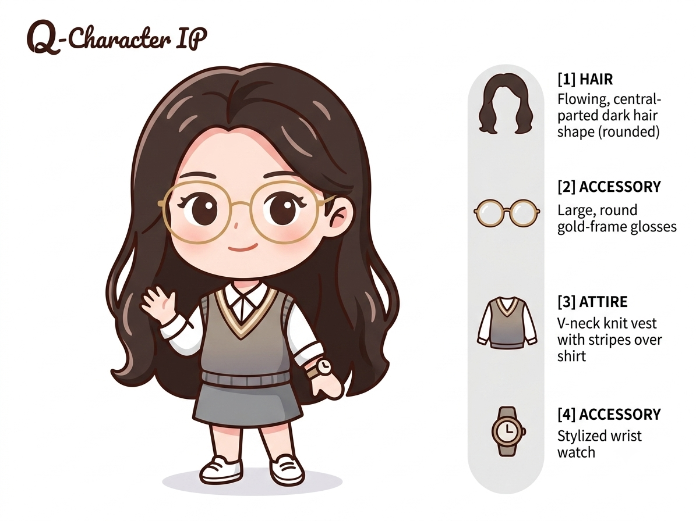

# Q版桌宠：Codex 直接生成规格文档

> 本文档用于让 Codex 直接创建桌宠项目、动作状态机、资源清单和动画生成提示词。
>
> 参考图：`./assets/q_character_ip_reference.png`



---

## 1. 给 Codex 的执行提示词

把下面整段作为 Codex 的首条任务指令，并让它读取当前 Markdown 文档：

```text
请完整阅读 `desktop_pet_codex_spec.md`，并把它视为唯一产品规格。

你的任务是创建一个可运行的 Q 版桌宠项目。默认技术栈使用 Electron + Vite + TypeScript + HTML Canvas；除非当前仓库已经存在更合适的技术栈，否则不要更换。程序需要支持透明无边框窗口、始终置顶、角色拖拽、鼠标点击反馈、状态机切换、精灵序列帧播放、空闲随机动作、输入中/思考中/回答中/成功/错误等系统状态。

先检查当前目录和现有代码，再按本文档创建或修改项目。不要只写设计说明，必须实际生成代码、配置、资源目录、动作清单、占位精灵、运行脚本和 README。

若当前环境具备图像生成能力：根据本文档的角色统一提示词、负面提示词和 100 个动作提示词逐项生成透明背景 PNG 序列帧，并写入指定目录。

若当前环境不具备图像生成能力：仍然完成整个可运行项目；为每个动作生成标准化 prompt 文件、manifest JSON、占位精灵图和替换说明。占位精灵必须保证程序可以启动并演示所有状态切换。

实施要求：
1. 严格保持动作 ID、目录结构和 manifest 字段一致。
2. 所有一次性动作播放结束后自动回到 `idle_breath`，除非状态机明确指定下一状态。
3. 所有循环动作必须无缝播放。
4. 角色脚底锚点固定，切换动作时不得发生明显跳位。
5. 使用确定性的状态机，避免同一时间多个动作竞争。
6. 对鼠标跟随、点击、拖拽和窗口边缘行为做节流。
7. 提供 `npm install`、`npm run dev`、`npm run build`。
8. 写自动校验脚本，检查动作目录、帧数、文件命名、透明通道和 manifest 一致性。
9. 最后运行测试或构建，修复错误，并在回复中列出实际完成的文件和启动方式。
```

---

## 2. 项目目标

创建一个可常驻桌面的透明窗口桌宠。角色以参考图为唯一视觉基准，通过 PNG 序列帧扩展为多状态动画。

核心能力：

- 透明、无边框、始终置顶窗口。
- 角色可拖拽，松手后播放落地缓冲。
- 单击、连续点击、悬停和鼠标追踪反馈。
- 空闲动作随机调度。
- 支持待机、用户输入、思考、搜索、回答、成功、错误、离线、低电量、提醒和节日动作。
- 支持 Sprite Sheet 或独立 PNG 帧。
- 所有动作由统一 manifest 驱动。
- 后续只需替换动作资源，不改业务代码。

---

## 3. 推荐目录结构

```text
desktop-pet/
├─ assets/
│  └─ q_character_ip_reference.png
├─ public/
│  └─ sprites/
│     ├─ idle_breath/
│     │  ├─ idle_breath_000.png
│     │  ├─ idle_breath_001.png
│     │  └─ ...
│     ├─ idle_blink/
│     └─ ...
├─ prompts/
│  ├─ master_prompt.txt
│  ├─ negative_prompt.txt
│  └─ actions/
│     ├─ idle_breath.txt
│     ├─ idle_blink.txt
│     └─ ...
├─ src/
│  ├─ main/
│  │  └─ electron.ts
│  ├─ renderer/
│  │  ├─ animation/
│  │  │  ├─ Animator.ts
│  │  │  ├─ StateMachine.ts
│  │  │  └─ AssetLoader.ts
│  │  ├─ interaction/
│  │  │  ├─ mouse.ts
│  │  │  ├─ drag.ts
│  │  │  └─ idleScheduler.ts
│  │  ├─ App.ts
│  │  └─ main.ts
│  ├─ data/
│  │  └─ animations.json
│  └─ types/
│     └─ animation.ts
├─ scripts/
│  ├─ build-placeholder-sprites.ts
│  └─ validate-assets.ts
├─ desktop_pet_codex_spec.md
├─ package.json
├─ tsconfig.json
└─ README.md
```

---

## 4. 角色视觉锁定

### 4.1 角色统一提示词

```text
同一位Q版桌宠女孩，严格保持参考图中的角色设计一致：长而蓬松的深棕色中分卷发，大号圆形金色镜框眼镜，白色长袖衬衫，灰色V领针织背心，灰色短裙，白色鞋子，手腕佩戴棕色圆形腕表，圆润可爱的脸型，大眼睛，淡粉色腮红，约2.5头身比例。

保持原始二维Q版插画风格，深棕色柔和描边，暖色皮肤，灰棕色服装配色，干净细腻的赛璐璐上色。完整全身，正面或非常轻微的三分之四视角，固定机位，固定人物大小，固定脚底锚点，透明背景，无场景，无文字。

生成连续动画帧。动作必须包含自然的起势、主体动作、缓冲和恢复。头发、裙摆和袖口具有轻微延迟摆动；眼镜稳定贴合面部；角色在所有帧中保持相同脸型、五官位置、服装结构、线条粗细和配色。
```

### 4.2 统一负面提示词

```text
不要改变角色发型、发色、脸型、眼镜、服装、腕表和身体比例；不要改变画风；不要写实化；不要3D化；不要增加复杂背景；不要文字、水印或边框；不要镜头移动、缩放和透视变化；不要角色位置漂移、忽大忽小或脚底锚点跳动。

不要多手、多脚、多手指、肢体错位、头发穿模、眼镜穿过脸部、服装结构变化、裙摆穿模、五官漂移、颜色闪烁、线条粗细跳变、随机增加配饰、左右手无规律交换、道具在不同帧中随机变形。
```

### 4.3 每个动作的完整提示词拼接规则

```text
[角色统一提示词]

动作 ID：{action_id}
动作名称：{action_name}
生成 {frames} 帧连续动画，帧率 {fps} fps，播放方式为 {play_mode}。
动作内容：{action_prompt}

技术要求：
- 每帧尺寸一致。
- 透明背景 PNG。
- 固定人物缩放、固定脚底锚点、固定视角。
- 首尾动作自然衔接；loop 动作必须无缝循环。
- once 动作包含起势、主体动作、缓冲、恢复。
- 角色轮廓和配色在全部帧中完全一致。

[统一负面提示词]
```

---

## 5. 动画资源规范

- 默认画布：`512 × 512`。
- 文件格式：透明背景 `PNG RGBA`。
- 命名格式：`{action_id}_{frameIndex:03d}.png`。
- 脚底锚点：画布横向中心附近、纵向 88% 位置。
- 每个动作单独目录。
- `loop` 动作的最后一帧不得简单复制第一帧造成停顿。
- `once` 动作结束后回到 `idle_breath`。
- 道具只在动作需要时出现；动作结束后必须被收起或自然消失。
- 默认不生成阴影；若需要接地感，只允许固定位置、低不透明度的椭圆软阴影。
- 动画切换时使用 50–120ms 的轻微交叉淡化，仅用于掩盖资源差异，不改变角色尺寸。

---

## 6. 动作清单与逐项提示词

| 序号 | 动作 ID | 分类 | 中文名称 | 帧数 | FPS | 播放 | 动作提示词 |
|---:|---|---|---|---:|---:|---|---|
| 001 | `idle_breath` | 基础待机 | 呼吸待机 | 8 | 8 | loop | 角色自然站立，身体和肩膀随着呼吸轻微上下起伏；长发末端、裙摆和袖口有轻微延迟摆动；中间自然眨眼一次；第一帧与最后一帧无缝衔接。 |
| 002 | `idle_blink` | 基础待机 | 普通眨眼 | 6 | 10 | loop | 角色保持站立，只做一次柔和眨眼；眼睛缓慢闭合后重新睁开；头部几乎不移动，表情温和。 |
| 003 | `idle_double_blink` | 基础待机 | 连续眨眼 | 8 | 10 | once | 角色快速眨眼两次；第二次眨眼后稍微歪头，露出可爱而疑惑的表情，再恢复标准姿势。 |
| 004 | `idle_look_around` | 基础待机 | 左右观察 | 10 | 8 | loop | 眼睛先看向左侧，头部轻微跟随，再缓慢看向右侧，最后回到正面；长发具有自然惯性。 |
| 005 | `idle_look_up` | 基础待机 | 抬头观察 | 8 | 8 | once | 角色慢慢抬头，眼睛看向屏幕上方；镜片高光轻微变化；停顿片刻后低头恢复。 |
| 006 | `idle_look_down` | 基础待机 | 低头观察 | 8 | 8 | once | 角色低头看向脚边；眼镜顺着头部角度自然倾斜；头发向前轻微垂落，然后重新抬头。 |
| 007 | `idle_head_tilt` | 基础待机 | 轻轻歪头 | 8 | 8 | loop | 角色将头部向一侧轻轻倾斜，眼睛保持注视用户，嘴角微微上扬，随后缓慢摆正。 |
| 008 | `idle_sway` | 基础待机 | 左右摇摆 | 12 | 8 | loop | 双手自然放在身体两侧；身体重心在左右脚之间缓慢转移；头发和裙摆随动作轻轻摆动。 |
| 009 | `idle_tiptoe` | 基础待机 | 踮脚待机 | 8 | 8 | loop | 角色轻轻踮起脚尖，身体上升少许，保持片刻后放下脚跟；动作轻盈可爱。 |
| 010 | `idle_tap_foot` | 基础待机 | 脚尖点地 | 10 | 8 | loop | 角色一只脚的脚尖有节奏地点两下地面，身体保持稳定，表现等待时的小动作。 |
| 011 | `adjust_glasses` | 整理休息 | 扶一下眼镜 | 10 | 10 | once | 抬起一只手，用食指轻轻推高圆形金框眼镜；镜片闪过小高光，然后放下手恢复站立。 |
| 012 | `clean_glasses` | 整理休息 | 擦拭眼镜 | 16 | 10 | once | 摘下眼镜，用衣袖小心擦拭镜片；眯着眼睛看不清前方；重新戴好后满意地点头。 |
| 013 | `fix_bangs` | 整理休息 | 整理刘海 | 10 | 10 | once | 抬手将额前一缕头发轻轻拨到一旁；头发柔顺回落；最后露出整洁而满意的微笑。 |
| 014 | `tuck_hair` | 整理休息 | 把头发别到耳后 | 12 | 10 | once | 用手将侧边长发轻轻别到耳后，露出耳朵和脸颊；害羞眨眼，然后放下手。 |
| 015 | `check_watch` | 整理休息 | 检查腕表 | 10 | 10 | once | 抬起佩戴腕表的手腕，低头认真查看时间；眉毛轻轻抬起，随后放下手腕恢复站立。 |
| 016 | `stretch` | 整理休息 | 伸懒腰 | 14 | 10 | once | 双手向上举起，身体充分伸展；眼睛轻轻闭上；脚尖稍微踮起；结束后放松双臂。 |
| 017 | `roll_shoulders` | 整理休息 | 活动肩膀 | 10 | 8 | loop | 先抬起双肩再缓慢放松，随后左右轻轻转动肩膀，表现久坐后的舒展。 |
| 018 | `yawn` | 整理休息 | 打哈欠 | 14 | 10 | once | 抬手遮住嘴巴；眼睛逐渐眯起；身体略微前倾打一个长哈欠；结束后揉揉眼睛。 |
| 019 | `sleepy_nod` | 整理休息 | 困倦点头 | 12 | 8 | loop | 眼皮逐渐下垂，脑袋慢慢低下；突然惊醒并快速抬头；眨眨眼后继续站好。 |
| 020 | `stand_sleep` | 整理休息 | 原地小睡 | 16 | 8 | loop | 闭着眼睛站立打瞌睡；身体轻轻左右晃动；头顶出现一个缓慢变大又消失的睡眠气泡。 |
| 021 | `wait_input` | 输入办公 | 等待用户输入 | 8 | 8 | loop | 双手放在身前，身体微微前倾，认真注视屏幕中央；偶尔眨眼，表现正在等待用户输入。 |
| 022 | `user_typing` | 输入办公 | 用户输入中 | 10 | 10 | loop | 目光跟随屏幕上的输入位置缓慢移动；头部轻微左右摆动；露出专注倾听和阅读的神情。 |
| 023 | `type_slow` | 输入办公 | 慢速打字 | 12 | 10 | loop | 面前出现简洁的小型悬浮键盘；双手交替轻轻敲击按键；身体随节奏略微起伏。 |
| 024 | `type_fast` | 输入办公 | 快速打字 | 12 | 12 | loop | 双手快速敲击悬浮键盘；表情认真专注；手指动作清晰有节奏；头发末端轻轻抖动。 |
| 025 | `type_one_finger` | 输入办公 | 单指输入 | 10 | 10 | loop | 伸出一根手指，在悬浮键盘上逐个寻找按键并按下；输入速度较慢；表情略显谨慎。 |
| 026 | `delete_text` | 输入办公 | 疯狂删除 | 12 | 12 | once | 发现输入错误后露出紧张表情；快速连续按下删除键；最后长舒一口气并擦擦额头。 |
| 027 | `send_message` | 输入办公 | 发送消息 | 10 | 10 | once | 完成输入后用力按下发送键；一个小型纸飞机图标向上飞出；角色开心挥手目送。 |
| 028 | `read_content` | 输入办公 | 阅读内容 | 12 | 8 | loop | 双手捧着一张简洁虚拟页面；眼睛从左向右缓慢移动；偶尔点头，表现认真阅读。 |
| 029 | `take_notes` | 输入办公 | 记录笔记 | 14 | 10 | loop | 拿着小笔记本和铅笔，低头快速书写几行内容；写完后抬头确认，再继续记录。 |
| 030 | `task_check` | 输入办公 | 完成任务打勾 | 12 | 10 | once | 在悬浮任务列表上画下一个勾；列表亮起完成标记；角色满意地点头并双手叉腰。 |
| 031 | `wave_hello` | 聊天交流 | 挥手打招呼 | 12 | 10 | loop | 抬起一只手，手掌朝向用户左右挥动三次；身体轻微跟随摆动；露出友好笑容。 |
| 032 | `bow` | 聊天交流 | 礼貌鞠躬 | 10 | 10 | once | 双手放在身前，身体向前轻轻鞠躬；长发自然垂落；停顿后重新站直。 |
| 033 | `listen` | 聊天交流 | 认真倾听 | 10 | 8 | loop | 身体微微靠近屏幕；一只手放在耳边；眼睛专注看向用户；偶尔轻轻点头。 |
| 034 | `talk_normal` | 聊天交流 | 普通说话 | 12 | 12 | loop | 嘴型自然变化；头部和双手配合做小幅表达动作；表情亲切，适合普通对话状态。 |
| 035 | `talk_happy` | 聊天交流 | 开心闲聊 | 14 | 12 | loop | 一边说话一边轻轻摆动双手；眉眼弯曲；身体节奏活泼；偶尔开心点头。 |
| 036 | `whisper` | 聊天交流 | 小声耳语 | 12 | 10 | once | 身体靠近屏幕；一只手挡在嘴边；眼睛左右观察；小声说出秘密后调皮地笑一下。 |
| 037 | `explain` | 聊天交流 | 认真解释 | 14 | 10 | loop | 抬起一只手伸出食指，另一只手配合比划；表情认真清晰，像在逐步说明问题。 |
| 038 | `ask_question` | 聊天交流 | 提出问题 | 10 | 10 | once | 歪头并抬起一只手；眉毛微微抬高；头顶出现简洁问号；等待片刻后恢复。 |
| 039 | `agree` | 聊天交流 | 表示同意 | 8 | 10 | once | 快速而明确地点头两次；眼睛明亮；最后竖起大拇指并露出肯定笑容。 |
| 040 | `disagree_soft` | 聊天交流 | 委婉不同意 | 10 | 10 | once | 轻轻左右摇头；双手在身前做小幅摆动；表情温和而歉意；最后恢复中性姿势。 |
| 041 | `smile` | 积极情绪 | 开心微笑 | 8 | 8 | loop | 眼睛微微弯起；脸颊淡粉色腮红更明显；嘴角缓慢上扬；身体轻轻摇摆。 |
| 042 | `laugh` | 积极情绪 | 开心大笑 | 12 | 12 | once | 闭上眼睛开怀大笑；身体微微后仰；双手放在腹部；肩膀随笑声上下抖动。 |
| 043 | `giggle` | 积极情绪 | 捂嘴偷笑 | 10 | 10 | once | 抬手遮住嘴巴；眼睛弯成月牙；肩膀轻轻抖动；最后放下手露出调皮微笑。 |
| 044 | `jump_excited` | 积极情绪 | 兴奋跳跃 | 14 | 12 | once | 先蹲下蓄力，再双脚离地向上跳起；双手高举；头发和裙摆上扬；落地后轻轻缓冲。 |
| 045 | `cheer` | 积极情绪 | 原地欢呼 | 12 | 10 | loop | 双手举过头顶左右挥动；身体左右踏步；表情非常兴奋，适合任务成功或获得奖励。 |
| 046 | `clap` | 积极情绪 | 鼓掌 | 10 | 10 | loop | 双手在胸前有节奏地拍掌三次；眼睛明亮；身体随拍掌节奏轻轻上下移动。 |
| 047 | `thumbs_up` | 积极情绪 | 竖起大拇指 | 10 | 10 | once | 向前伸出一只手并竖起大拇指；身体微微前倾；眼镜闪过小高光；最后满意点头。 |
| 048 | `heart_hands` | 积极情绪 | 双手比心 | 12 | 10 | once | 双手在胸前组成心形；脸颊泛红；身体轻轻歪向一侧；心形小光点缓慢飘出。 |
| 049 | `shy_happy` | 积极情绪 | 害羞开心 | 12 | 8 | loop | 双手放在脸颊附近；脸颊明显变红；眼神稍微移开；脚尖轻轻点地；嘴角上扬。 |
| 050 | `proud` | 积极情绪 | 骄傲叉腰 | 10 | 10 | once | 双手叉腰；挺起胸口；微微抬起下巴；闭上一只眼睛露出自信笑容；头发轻轻向后摆动。 |
| 051 | `confused` | 复杂情绪 | 疑惑挠头 | 12 | 10 | once | 眉毛微皱；抬手轻轻挠头；头部向一侧倾斜；头顶出现小问号；最后保持疑惑表情。 |
| 052 | `thinking` | 复杂情绪 | 努力思考 | 12 | 8 | loop | 一只手托住下巴，另一只手抱在胸前；眼睛向上移动；偶尔皱眉并轻轻点头。 |
| 053 | `idea` | 复杂情绪 | 突然想到答案 | 10 | 10 | once | 先保持思考姿势；随后眼睛突然睁大；头顶出现发光小灯泡；伸出食指并开心点头。 |
| 054 | `surprised` | 复杂情绪 | 惊讶后退 | 10 | 12 | once | 眼睛突然睁大；嘴巴变成小圆形；身体快速向后缩一下；双手抬到胸前；头发向后摆动。 |
| 055 | `awkward` | 复杂情绪 | 尴尬冒汗 | 10 | 10 | once | 保持僵硬微笑；眼神缓慢移向旁边；额头出现一滴汗珠；手指不安地互相碰触。 |
| 056 | `sad` | 复杂情绪 | 失落低头 | 12 | 8 | once | 肩膀缓慢下沉；低下头；眼睛失去光彩；双手垂在身体两侧；头发向前遮住部分脸颊。 |
| 057 | `cry_soft` | 复杂情绪 | 轻轻哭泣 | 14 | 8 | loop | 眼睛湿润；抬手擦拭眼角小泪珠；肩膀轻轻抽动；保持克制而可爱的哭泣状态。 |
| 058 | `angry_pout` | 复杂情绪 | 生气鼓脸 | 10 | 8 | loop | 双手叉腰；脸颊鼓起；眉毛向下压；身体轻轻上下起伏；头顶出现一小团蒸汽。 |
| 059 | `stomp` | 复杂情绪 | 气愤跺脚 | 12 | 12 | once | 皱眉并抬起一只脚，用力跺地一次；双手握拳；头发和裙摆因冲击短暂弹起。 |
| 060 | `scared` | 复杂情绪 | 害怕发抖 | 12 | 10 | loop | 双手抱住自己；肩膀缩起；身体进行细小快速的左右抖动；眼睛紧张观察四周。 |
| 061 | `loading` | 系统状态 | 加载中 | 12 | 10 | loop | 伸出一根手指，在空中画圆；一个简洁环形加载图标围绕指尖旋转；角色耐心等待。 |
| 062 | `calculating` | 系统状态 | 认真计算中 | 14 | 10 | loop | 面前浮现少量简洁数字和符号；眼睛快速左右移动；手指轻轻计算；头顶偶尔闪现小火花。 |
| 063 | `searching` | 系统状态 | 搜索中 | 12 | 10 | loop | 拿着小型放大镜，身体左右探查；放大镜依次对准屏幕不同位置；表情认真专注。 |
| 064 | `success` | 系统状态 | 成功完成 | 12 | 12 | once | 身边出现完成勾形光效；双手握拳开心上举；随后竖起大拇指。 |
| 065 | `error` | 系统状态 | 出现错误 | 12 | 12 | once | 先愣住，眼睛睁大；面前出现简洁错误叉号；随后慌张快速摆手并露出歉意表情。 |
| 066 | `warning` | 系统状态 | 警告提醒 | 10 | 10 | loop | 抬起一只手做停止手势；另一只手指向旁边简洁警告三角形；表情认真但不过于严厉。 |
| 067 | `offline` | 系统状态 | 网络断开 | 12 | 10 | once | 查看逐渐熄灭的网络图标；露出困惑表情；轻轻拍打图标两下；最后无奈摊开双手。 |
| 068 | `reconnect` | 系统状态 | 重新连接 | 14 | 10 | once | 双手握住断开的两段连接线，将其重新接在一起；连接处亮起小光点；角色松一口气。 |
| 069 | `low_battery` | 系统状态 | 电量不足 | 12 | 8 | loop | 身体显得疲惫；动作速度变慢；手中低电量图标轻轻闪烁；角色打哈欠并缓慢下沉。 |
| 070 | `charging` | 系统状态 | 充电恢复 | 14 | 10 | once | 旁边出现充电闪电图标；身体逐渐恢复精神；眼睛重新明亮；最后兴奋地原地小跳一下。 |
| 071 | `follow_cursor` | 桌面互动 | 跟随鼠标 | 8 | 12 | loop | 头部和眼睛平滑跟随鼠标指针移动；身体保持原位；视线反应稍有延迟，表现自然灵敏。 |
| 072 | `chase_cursor` | 桌面互动 | 追逐鼠标 | 16 | 12 | loop | 发现鼠标指针后快速迈出小步追赶；双手向前伸；头发向后飘动；始终差一点抓住指针。 |
| 073 | `catch_cursor` | 桌面互动 | 抓住鼠标 | 12 | 12 | once | 先观察移动的鼠标指针；突然向前扑出并用双手抓住；成功后露出得意开心的表情。 |
| 074 | `clicked` | 桌面互动 | 被鼠标点击 | 8 | 12 | once | 被点击时身体快速缩一下；眼睛闭紧；头发和裙摆短暂弹起；随后睁眼看向用户。 |
| 075 | `multi_clicked` | 桌面互动 | 被连续点击 | 12 | 12 | once | 连续受到点击；身体像柔软弹簧一样左右轻晃；最后鼓起脸颊并双手叉腰表示抗议。 |
| 076 | `dragged` | 桌面互动 | 被拖拽移动 | 12 | 12 | loop | 身体被外力向一侧拖动；双脚暂时离地；双手和双腿自然下垂；表情惊讶但不恐慌。 |
| 077 | `drop_landing` | 桌面互动 | 拖拽后落地 | 12 | 12 | once | 从短距离落下；双脚接触地面后膝盖弯曲缓冲；头发和裙摆上下弹动；随后重新站稳。 |
| 078 | `window_ledge` | 桌面互动 | 趴在窗口边缘 | 14 | 10 | loop | 从窗口下方慢慢探出头和双手；趴在边缘眨眼观察用户；只露出上半身并轻轻摇头。 |
| 079 | `peek_side` | 桌面互动 | 从屏幕侧边偷看 | 12 | 10 | loop | 从屏幕侧边缓慢探出半张脸；眼睛先左右观察；随后露出完整脸庞并快速缩回。 |
| 080 | `push_window` | 桌面互动 | 推开窗口 | 14 | 10 | once | 双手抵住简洁窗口边框，用力向一侧推动；双脚向后蹬地；成功推开后擦擦额头。 |
| 081 | `drink_water` | 生活陪伴 | 喝水提醒 | 14 | 10 | once | 双手拿起透明小水杯，慢慢喝一口水；放下杯子后指向用户，再指向水杯，提醒用户补水。 |
| 082 | `hot_drink` | 生活陪伴 | 喝热饮 | 16 | 8 | loop | 双手捧着冒出少量热气的小杯子；轻轻吹气后喝一小口；脸上露出温暖满足的表情。 |
| 083 | `eat_cookie` | 生活陪伴 | 吃小饼干 | 14 | 10 | once | 拿起一块小饼干咬下一口；脸颊轻轻鼓起进行咀嚼；吃完后满足地眯起眼睛。 |
| 084 | `read_book` | 生活陪伴 | 阅读小书 | 16 | 8 | loop | 双手捧着一本小书；眼睛从左向右阅读；偶尔翻动一页，并轻轻推一下眼镜。 |
| 085 | `listen_music` | 生活陪伴 | 听音乐 | 14 | 10 | loop | 戴着简洁耳机；闭上眼睛随着音乐左右轻轻摇摆；脚尖有节奏地点地。 |
| 086 | `dance` | 生活陪伴 | 轻轻跳舞 | 20 | 12 | loop | 进行简单可爱的左右踏步舞蹈；双手配合挥动；旋转幅度较小；头发和裙摆自然摆动。 |
| 087 | `eye_rest` | 生活陪伴 | 眼部休息 | 14 | 10 | once | 摘下眼镜；闭上眼睛；用双手轻轻按摩眼周；休息片刻后重新戴好眼镜。 |
| 088 | `sit_stretch_reminder` | 生活陪伴 | 久坐拉伸提醒 | 16 | 10 | once | 先指向用户；随后双手向上伸展；身体向左右各拉伸一次；最后招手示意用户一起活动。 |
| 089 | `good_morning` | 生活陪伴 | 早安问候 | 14 | 10 | once | 从困倦状态慢慢睁眼；伸懒腰；整理眼镜和头发；随后精神地挥手并露出早安笑容。 |
| 090 | `good_night` | 生活陪伴 | 晚安休息 | 18 | 8 | once | 打哈欠；向用户轻轻挥手告别；抱住一个小枕头坐下；闭上眼睛并逐渐进入睡眠状态。 |
| 091 | `thanks_heart` | 特殊效果 | 爱心感谢 | 14 | 10 | once | 双手放在胸前表达感谢；随后比出心形；数颗小爱心缓慢向上飘动；角色轻轻鞠躬。 |
| 092 | `encourage_stars` | 特殊效果 | 星星鼓励 | 12 | 10 | once | 握起拳头为用户加油；身边出现数颗旋转小星星；最后向前伸出拳头做鼓励动作。 |
| 093 | `confetti` | 特殊效果 | 撒花庆祝 | 16 | 12 | once | 向上抛出少量彩纸；彩纸缓慢落下；角色在下方开心鼓掌并左右小跳。 |
| 094 | `birthday` | 特殊效果 | 生日祝福 | 18 | 10 | once | 戴上简洁生日帽；双手捧着小蛋糕；蜡烛火焰轻轻摇动；角色闭眼许愿并开心微笑。 |
| 095 | `gift` | 特殊效果 | 节日礼物 | 16 | 10 | once | 抱着一个小礼物盒走出；双手将礼物递向用户；礼物盒打开时出现柔和光点。 |
| 096 | `appear_magic` | 特殊效果 | 魔法出现 | 14 | 12 | once | 数颗小光点从地面旋转升起；角色轮廓逐渐显现；最后完整落地并整理衣服。 |
| 097 | `disappear_wave` | 特殊效果 | 挥手消失 | 14 | 12 | once | 向用户挥手告别；身体从脚部开始化为柔和小光点；逐渐向上消失。 |
| 098 | `jump_in_bottom` | 特殊效果 | 从屏幕底部跳出 | 14 | 12 | once | 先从屏幕底部露出头顶；双手抓住边缘，用力爬上来；最后跳到桌面并站稳。 |
| 099 | `spin_transition` | 特殊效果 | 旋转换状态 | 16 | 12 | once | 原地快速旋转一圈；长发和裙摆形成圆润弧线；小光点环绕身体；停止后进入新的状态姿势。 |
| 100 | `reset_default` | 特殊效果 | 恢复默认状态 | 12 | 10 | once | 收起当前道具；整理头发、眼镜和衣服；向用户轻轻点头；平滑恢复到标准呼吸待机姿势。 |

---

## 7. 推荐状态机

### 7.1 顶层状态

```text
BOOT
APPEAR
IDLE
LISTENING
USER_TYPING
THINKING
RESPONDING
SUCCESS
ERROR
OFFLINE
LOW_BATTERY
SLEEP
DRAGGING
REACTION
DISAPPEAR
```

### 7.2 默认映射

| 顶层状态 | 默认动作 |
|---|---|
| `BOOT` | `appear_magic` |
| `APPEAR` | `jump_in_bottom` |
| `IDLE` | `idle_breath` |
| `LISTENING` | `listen` |
| `USER_TYPING` | `user_typing` |
| `THINKING` | `thinking` 或 `loading` |
| `RESPONDING` | `talk_normal` |
| `SUCCESS` | `success` |
| `ERROR` | `error` |
| `OFFLINE` | `offline` |
| `LOW_BATTERY` | `low_battery` |
| `SLEEP` | `stand_sleep` 或 `good_night` |
| `DRAGGING` | `dragged` |
| `REACTION` | 由事件指定 |
| `DISAPPEAR` | `disappear_wave` |

### 7.3 状态优先级

```text
DRAGGING
> ERROR / OFFLINE
> SUCCESS
> RESPONDING
> THINKING
> USER_TYPING
> REACTION
> SLEEP
> IDLE
```

### 7.4 空闲随机动作池

```json
[
  "idle_blink",
  "idle_double_blink",
  "idle_look_around",
  "idle_head_tilt",
  "idle_sway",
  "idle_tiptoe",
  "idle_tap_foot",
  "adjust_glasses",
  "fix_bangs",
  "check_watch",
  "stretch",
  "yawn"
]
```

建议规则：

- 进入 `IDLE` 后先播放 `idle_breath`。
- 8–18 秒没有外部事件，随机触发一次空闲动作。
- 连续两次不得选择同一动作。
- `yawn`、`sleepy_nod`、`stand_sleep` 只在长时间无操作或夜间触发。
- 任意高优先级事件到来时，先让当前帧完成到安全中断点，再切换状态。

---

## 8. 交互规则

### 单击

```text
clicked → idle_breath
```

### 1.2 秒内连续点击三次以上

```text
clicked → multi_clicked → angry_pout → idle_breath
```

### 拖拽

```text
pointerDown → dragged(loop)
pointerMove → 更新窗口位置
pointerUp → drop_landing(once) → idle_breath
```

### 鼠标悬停

- 角色眼睛轻微跟随鼠标。
- 鼠标快速移动时可切换为 `follow_cursor`。
- 低概率触发 `chase_cursor`。
- 不应持续抢占工作状态。

### 用户输入

```text
wait_input → user_typing → thinking → talk_normal
```

### 请求成功

```text
loading → success → thumbs_up → idle_breath
```

### 请求失败

```text
loading → error → awkward → bow → idle_breath
```

### 长时间无操作

```text
idle_breath → idle_look_around → check_watch → yawn
→ sleepy_nod → stand_sleep
```

---

## 9. Manifest 数据结构

Codex 应生成 `src/data/animations.json`，字段格式如下：

```json
[
  {
    "id": "idle_breath",
    "category": "基础待机",
    "name": "呼吸待机",
    "frames": 8,
    "fps": 8,
    "playMode": "loop",
    "prompt": "角色自然站立，身体和肩膀随着呼吸轻微上下起伏；长发末端、裙摆和袖口有轻微延迟摆动；中间自然眨眼一次；第一帧与最后一帧无缝衔接。",
    "returnTo": null
  },
  {
    "id": "idle_blink",
    "category": "基础待机",
    "name": "普通眨眼",
    "frames": 6,
    "fps": 10,
    "playMode": "loop",
    "prompt": "角色保持站立，只做一次柔和眨眼；眼睛缓慢闭合后重新睁开；头部几乎不移动，表情温和。",
    "returnTo": null
  },
  {
    "id": "idle_double_blink",
    "category": "基础待机",
    "name": "连续眨眼",
    "frames": 8,
    "fps": 10,
    "playMode": "once",
    "prompt": "角色快速眨眼两次；第二次眨眼后稍微歪头，露出可爱而疑惑的表情，再恢复标准姿势。",
    "returnTo": "idle_breath"
  }
]
```

完整 manifest 必须包含本文档的全部 100 个动作。

TypeScript 类型建议：

```ts
export type PlayMode = "loop" | "once";

export interface AnimationDefinition {
  id: string;
  category: string;
  name: string;
  frames: number;
  fps: number;
  playMode: PlayMode;
  prompt: string;
  returnTo?: string | null;
  anchor?: {
    x: number;
    y: number;
  };
}
```

---

## 10. 动画播放器要求

`Animator` 至少支持：

- 按动作 ID 加载帧序列。
- 独立控制 FPS。
- `loop` 与 `once` 两种模式。
- 一次性动作结束回调。
- 预加载常用动作。
- 缺帧时自动降级到占位资源。
- 切换时保持统一锚点。
- 页面失焦时降低刷新率。
- 高 DPI 屏幕保持清晰。
- 资源未加载完成时不显示破图。

---

## 11. 占位资源策略

当无法直接生成角色序列帧时，Codex 必须：

1. 用参考图裁切或简化为单帧占位角色。
2. 通过 Canvas 轻微位移、缩放、旋转和透明度变化模拟动作。
3. 为每个动作生成符合帧数要求的透明 PNG。
4. 在 `README.md` 明确标记这些是占位资源。
5. 保留完全一致的文件名和目录结构，方便后续直接替换为正式序列帧。

占位动画不得改变角色整体视觉，只用于验证状态机与资源管线。

---

## 12. 资源校验脚本

`validate-assets.ts` 必须检查：

- manifest 中每个动作目录是否存在。
- 实际 PNG 数量是否等于 `frames`。
- 文件名是否从 `000` 连续编号。
- 图片宽高是否一致。
- PNG 是否包含 Alpha 通道。
- 同一动作内脚底锚点是否大致稳定。
- 是否存在 manifest 未登记的动作目录。
- 是否存在空文件或无法读取的图片。

校验失败时返回非零退出码。

---

## 13. 验收标准

- `npm install` 成功。
- `npm run dev` 能启动透明桌面窗口。
- 角色可以被拖拽。
- 单击和连续点击反馈正确。
- 所有顶层状态可通过开发者调试面板触发。
- 100 个动作均存在 manifest 条目。
- 动作播放器在缺少正式资源时仍能播放占位序列。
- 任意一次性动作结束后不会卡死。
- 空闲调度不会打断拖拽、错误、回答等高优先级状态。
- `npm run build` 成功。
- `npm run validate:assets` 成功。
- README 包含安装、运行、构建、资源替换和新增动作说明。

---

## 14. 最小实现优先级

第一阶段必须完成以下 12 个核心动作：

```text
idle_breath
idle_blink
idle_look_around
wave_hello
user_typing
type_fast
listen
thinking
talk_normal
loading
success
error
```

第二阶段补齐：

```text
clicked
multi_clicked
dragged
drop_landing
follow_cursor
stand_sleep
good_morning
good_night
offline
low_battery
```

第三阶段补齐本文档剩余全部动作。

---

## 15. 最终交付清单

Codex 最终必须交付：

- 可运行桌宠工程。
- 100 个动作的 `animations.json`。
- 100 个动作的独立 prompt 文本。
- 统一正向与负向提示词。
- 完整占位资源或正式 PNG 帧。
- 状态机和动画播放器。
- 鼠标点击、拖拽、跟随交互。
- 空闲随机调度。
- 资源校验脚本。
- README 和运行命令。
- 最终构建通过记录。
